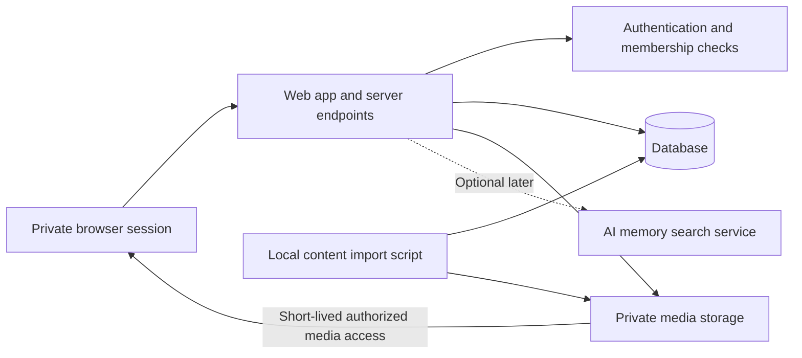

# Application architecture

Status: first local slice implemented September 22, 2026 with TypeScript, Next.js, React, and SVG/CSS. Backend and provider choices below remain proposed.

## Goal

Keep one understandable application while giving backend work real depth. Managed hosting does not remove the need to design the database, enforce access, validate requests, handle failures, and test behavior.

## Proposed stack

- TypeScript for application code.
- Next.js and React for pages, the memory viewer, and server endpoints.
- A Three.js scene for constellation depth, stars, and camera movement if the initial experiment supports it. Compare against a simpler SVG/CSS implementation before committing; visual quality matters more than renderer novelty.
- PostgreSQL for structured data, with Supabase as the candidate managed database, authentication, and private storage provider.
- One web deployment. Content processing starts as a local script, not a permanent worker service.

Versions, plan limits, and hosting compatibility must be checked at setup time. These are proposals, not installed dependencies or purchased services.

## System layout

## Responsibility boundaries

The browser owns camera position, open panels, transition animation, and temporary loading status. The database owns memory records, ordering, memberships, and saved exploration progress. The server validates writes and authorizes media access. The renderer never becomes the database: a star refers to a stable memory ID.

Use an ordinary module layout initially: `src/features/constellations`, `memories`, `progress`, and `access`; `src/server` for backend services; `scripts` for import; `db/migrations` for schema changes; `tests` for meaningful checks. Avoid splitting a solo project into many packages without a concrete need.

## Suggested server contracts

| Operation | Input | Result |
|---|---|---|
| GET /api/world | Session | Authorized year and star summaries, progress |
| GET /api/memories/:id | Memory ID, session | Authorized note and media references |
| GET /api/assets/:id/access | Asset ID, session | Short-lived media URL and expiry |
| PUT /api/progress/:memoryId | Memory ID, session | Idempotently saved opened state |
| POST /api/demo/reset | Demo session only | Reset isolated demo progress |

Equivalent server functions are acceptable; maintain the same boundaries. Never accept owner identity from the browser as proof of permission. Return understandable errors for unauthenticated, forbidden, missing, and temporarily unavailable cases. Avoid revealing whether another user's private record exists.

## Learning checkpoints

Before moving on, explain why each table exists, where a permission check happens, why retries do not duplicate progress, and what occurs when media access expires. Use AI assistance, but manually trace one full request from click to database and back.

## Done when

One authorized memory travels through the real server and data layer into the viewer; an unrelated user is refused; duplicate progress writes are safe; the renderer can be replaced without changing memory IDs or ownership rules.
